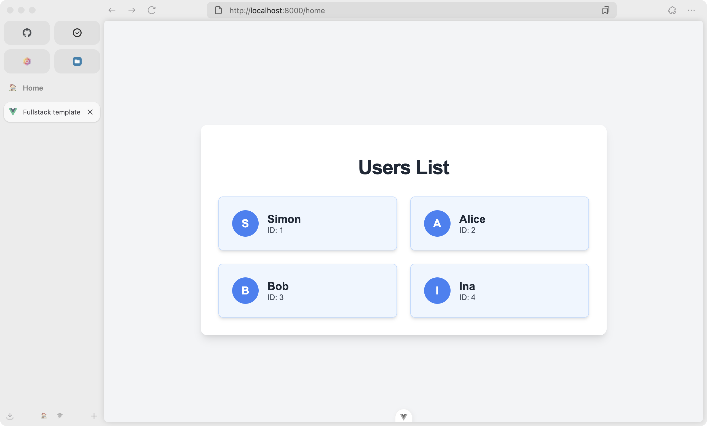

# Fullstack template

A template to write fullstack applications with Rust and VueJS

## Features

- [x] Postgres database
- [x] Rust backend with diesel and actix-web
- [x] Vue Frontend with sample application
- [x] Support for hot reloading in dev environment
- [ ] Auto initialization (init.py)

## Start application

- Start development Server: `docker compose up --build -d`
- Start production Server: `docker compose -f docker-compose.yml up --build -d`

## Access components

- Database: `localhost:5432`
- Backend: `localhost:8080`
- Frontend: `localhost:8000`

The Backend and the Database are not accessable from the outside, if the compose is startet in a production environment.

## Example picture

